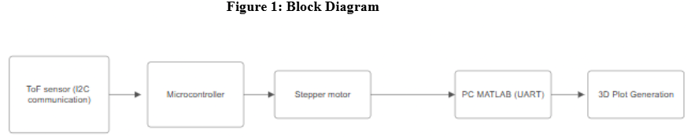
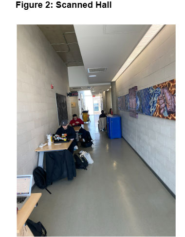
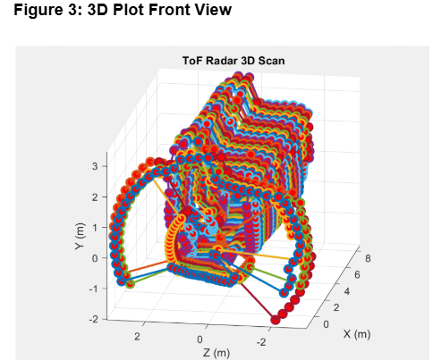
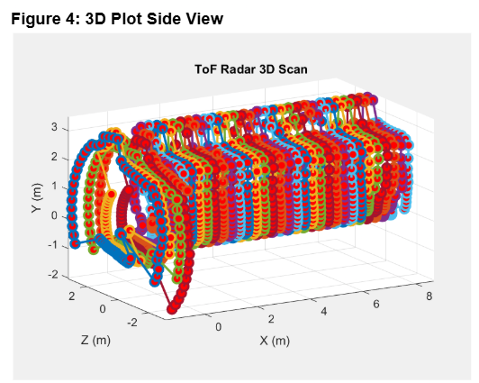

# 3D Time-of-Flight (ToF) Scanning System

## Overview

This project is a 3D scanning system that uses a Time-of-Flight (ToF) distance sensor mounted on a stepper motor to measure the surrounding environment and generate a 3D representation.

The system uses an MSP432E4 microcontroller to control the ToF sensor and stepper motor. Distance measurements are collected through I2C and transmitted to a computer through UART. MATLAB then processes the measurements and generates a 3D plot of the scanned environment.

The scanner performs 64 measurements during each 360° rotation, with measurements taken every 5.625°.

## System Block Diagram



## Features

- 360° environmental scanning
- 64 distance measurements per rotation
- 5.625° angular resolution
- Time-of-Flight distance measurement
- Stepper motor controlled rotation
- Clockwise and counterclockwise scanning
- Push-button start/stop control
- UART communication with a PC
- I2C communication between the ToF sensor and microcontroller
- MATLAB-based data processing and visualization
- 3D reconstruction of the scanned environment
- Multiple scans combined to create a 3D representation

## Hardware

| Component | Description |
|-----------|-------------|
| MSP432E4 | Main microcontroller |
| VL53L1X | Time-of-Flight distance sensor |
| Stepper Motor | Rotates the ToF sensor |
| ULN2003 | Stepper motor driver |
| Push Button | Starts and stops scanning |
| LEDs | Indicate measurement and communication status |
| PC | Runs MATLAB for data processing |

### Operating Voltages

- Stepper motor: 5–12 VDC
- ToF sensor: 2.6–3.5 V
- Push buttons: 3.3 V

### Approximate Cost

| Component | Cost |
|-----------|------|
| ToF Sensor | $30 |
| Stepper Motor | $10 |
| MSP432E4 | $70 |
| **Total** | **~$110** |

## Hardware Connections

| Component | MSP432E4 Connection |
|-----------|---------------------|
| ToF SDA | PB3 |
| ToF SCL | PB2 |
| Stepper Motor | PH0–PH3 |
| Push Button | PJ0 |
| LEDs | PF0, PN0, PN1 |

The MSP432E4 operates with a 28 MHz bus clock.

## Communication

### I2C

The ToF sensor communicates with the MSP432E4 using I2C.

### UART

The MSP432E4 communicates with the computer using UART at:

```text
Baud Rate: 115200 bps
```

MATLAB receives the distance measurements through the serial connection and processes the incoming data.

## Scanning Process

The scanning process operates as follows:

1. The user presses the push button to start the scan.
2. The stepper motor begins rotating the ToF sensor.
3. The ToF sensor measures the distance to surrounding objects.
4. The MSP432E4 records each measurement.
5. Measurements are taken every 5.625°.
6. After 64 measurements, a complete 360° scan is obtained.
7. The data is transmitted to MATLAB through UART.
8. MATLAB converts the measurements into Cartesian coordinates.
9. The resulting points are plotted in 3D.
10. The motor pauses and reverses direction before the next scan.

The system uses clockwise and counterclockwise rotation to continue scanning while maintaining the correct angle sequence in MATLAB.

## Time-of-Flight Measurement

The ToF sensor determines distance by measuring the time required for a transmitted laser pulse to travel to an object and return to the sensor.

The distance is calculated using:

```text
d = (c × t) / 2
```

where:

- `d` = measured distance
- `c` = speed of light
- `t` = measured round-trip time

The ToF sensor provides the distance measurement in millimetres.

## 3D Coordinate Conversion

The measured distance and motor angle are converted into Cartesian coordinates.

For each measurement:

```text
y = d × sin(θ)
z = d × cos(θ)
```

The X coordinate represents the displacement between successive scans:

```text
x = (scan - 1) × displacement
```

The default displacement between scans is 0.3 m.

Therefore, each 360° rotation produces a 2D slice in the Y-Z plane. Multiple scans at different X positions are combined to create the final 3D representation.

### Example

For:

```text
Distance = 2 m
Angle = 30°
Scan = 2
X displacement = 0.3 m
```

The resulting coordinates are approximately:

```text
x = 0.3 m
y = 1.0 m
z = 1.73 m
```

## MATLAB Visualization

MATLAB is used to:

- Receive data from the microcontroller
- Process distance measurements
- Convert measurements into Cartesian coordinates
- Combine multiple scan slices
- Generate the final 3D visualization

The general data flow is:

```text
ToF Measurements
       ↓
MSP432E4
       ↓
UART
       ↓
MATLAB
       ↓
Distance Processing
       ↓
Coordinate Conversion
       ↓
3D Visualization
```

## Results

The scanner was tested in an indoor hallway environment.

The resulting 3D scan captured features of the environment including:

- Different ceiling heights
- Desks
- Changes in wall width
- Overall hallway structure

### Scanned Hallway



### 3D Scan - Front View



### 3D Scan - Side View



## Characteristic Table


## System Performance

| Parameter | Value |
|-----------|-------|
| Microcontroller Bus Speed | 28 MHz |
| UART Baud Rate | 115200 bps |
| Measurements per Rotation | 64 |
| Angular Resolution | 5.625° |
| ToF Resolution | 1 mm |
| Default X Displacement | 0.3 m |
| Stepper Motor Voltage | 5–12 VDC |
| ToF Sensor Voltage | 2.6–3.5 V |

## Limitations

### Floating-Point Precision

The MSP432E4 uses a single-precision floating-point unit. This can introduce rounding errors during calculations.

To improve the accuracy of trigonometric calculations, MATLAB performs the coordinate calculations using 64-bit precision. However, the original distance measurements are still limited by the 32-bit measurements received from the microcontroller.

### ToF Resolution

The ToF sensor has a resolution of approximately 1 mm, resulting in a theoretical quantization error of approximately ±0.5 mm.

### UART Communication

Although the PC supports higher baud rates, the system uses 115200 bps because it is widely supported and provides reliable communication.

### Scan Speed

The overall scanning speed is limited by:

- ToF measurement time
- Stepper motor movement
- UART transmission speed
- Processing time

The stepper motor delay was experimentally reduced until instability occurred, limiting how quickly the scanner could operate.

## Technologies Used

### Programming

- C
- MATLAB

### Embedded Systems

- MSP432E4
- I2C
- UART
- GPIO
- Stepper motor control
- Time-of-Flight sensing

### Software

- Keil uVision
- MATLAB

### Hardware

- VL53L1X ToF sensor
- Stepper motor
- ULN2003 motor driver
- MSP432E4 microcontroller
- Oscilloscope

## Skills Demonstrated

- Embedded C programming
- Microcontroller programming
- I2C communication
- UART communication
- GPIO configuration
- Sensor integration
- Stepper motor control
- Serial data acquisition
- Signal and measurement processing
- Coordinate transformations
- MATLAB data visualization
- Hardware/software integration
- Debugging and testing

## Project Architecture

The project consists of two main software components.

### Microcontroller

The MSP432E4 is responsible for:

- Controlling the stepper motor
- Triggering and reading ToF measurements
- Managing I2C communication
- Handling push-button input
- Controlling status LEDs
- Transmitting measurements through UART

### MATLAB

MATLAB is responsible for:

- Receiving measurements from the microcontroller
- Processing the measurement data
- Converting polar measurements into Cartesian coordinates
- Accounting for scan displacement
- Generating the 3D visualization

## Project Documentation

The project was developed as part of McMaster University's 2DX3 course.

The implementation involved integrating embedded hardware, sensor communication, motor control, serial communication, and MATLAB visualization into a complete 3D scanning system.

## Source Code

The source code is not publicly available. This repository provides an overview of the system design, hardware implementation, scanning process, and results.

The original academic report is not included in the repository.

## References

- Texas Instruments, MSP432E4 Technical Reference Manual, 2020.
- STMicroelectronics, VL53L1X Time-of-Flight Sensor Datasheet, Revision 3, 2018.
- Velleman, VMA401 5V Stepper Motor with ULN2003 Driver Manual, 2018.
